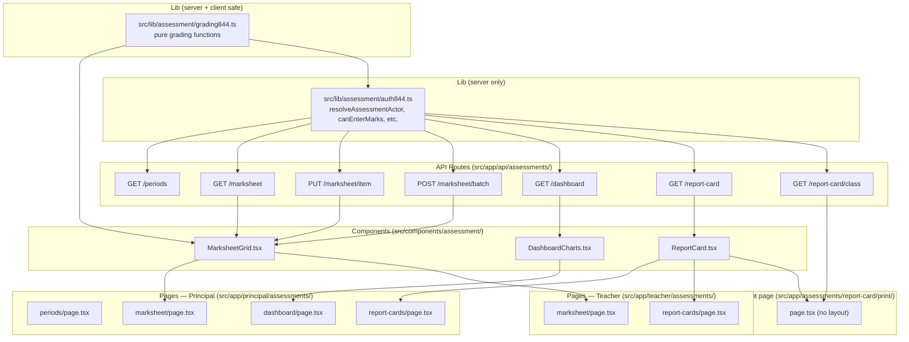

# Design Document: 8-4-4 Assessment Flow

## Overview

This document describes the full UI and API layer for the 8-4-4 (KCSE) assessment subsystem.
The underlying data models (`AssessmentFramework`, `AssessmentPeriod`, `Paper`, `AssessmentItem`, `AssessmentRole`) already exist in the schema. The work here is the grading utility, auth utility, API routes, React components, and pages that sit on top of those models.

The feature has three surfaces: a spreadsheet marksheet for score entry, an analytics dashboard for aggregate performance metrics, and a per-student report card with browser-print PDF export.

---

## Architecture Overview




---

## 1. Grading Utility — `src/lib/assessment/grading844.ts`

Pure functions, no imports from Prisma or server-only modules. Safe to import from both server components and client components.

### Grade Scale

```typescript
export type KcseGrade = 'A' | 'A-' | 'B+' | 'B' | 'B-' | 'C+' | 'C' | 'C-' | 'D+' | 'D' | 'D-' | 'E';

export interface GradeResult {
  grade: KcseGrade;
  points: number; // 1–12
}

// Bands: lower bound (inclusive) → grade
const GRADE_BANDS: Array<[number, KcseGrade, number]> = [
  [75, 'A',  12],
  [70, 'A-', 11],
  [65, 'B+', 10],
  [60, 'B',   9],
  [55, 'B-',  8],
  [50, 'C+',  7],
  [45, 'C',   6],
  [40, 'C-',  5],
  [35, 'D+',  4],
  [30, 'D',   3],
  [25, 'D-',  2],
  [ 0, 'E',   1],
];
```

### Exported Functions

```typescript
/** Map a 0–100 percentage to KCSE grade + points. */
export function scoreToGrade(percentage: number): GradeResult

/**
 * Compute the subject score (0–100 percentage) from one or two papers.
 * Returns null if any required paper score is null (Not_Entered).
 * paperScores and paperMaxMarks must be parallel arrays of the same length.
 */
export function subjectScore(
  paperScores: (number | null)[],
  paperMaxMarks: number[]
): number | null

/**
 * Compute the student's mean grade from an array of per-subject grade points.
 * Null entries (Not_Entered subjects) are excluded from the average.
 * Returns null if no valid subject grades exist.
 * Returns { meanPoints: number (2 dp), grade: KcseGrade }.
 */
export function meanGrade(
  subjectPoints: (number | null)[]
): { meanPoints: number; grade: KcseGrade } | null

/**
 * Dense-rank an array of numeric scores (descending).
 * Returns parallel array of rank integers. Null scores get rank null.
 */
export function denseRank(scores: (number | null)[]): (number | null)[]
```

### Behaviour notes

- `subjectScore` with a single paper: `(score / maxMarks) * 100`.
- `subjectScore` with two papers: `(s1 * m1 + s2 * m2) / (m1 + m2) * 100` — weighted average already expressed as a percentage.
- A score of exactly `0` is a valid `Genuine_Zero` and IS included in calculations.
- `meanGrade` rounds `meanPoints` to 2 decimal places using `Math.round(x * 100) / 100`, then uses `scoreToGrade` to map back to a letter.


---

## 2. Assessment Auth Utility — `src/lib/assessment/auth844.ts`

Server-only. Import only inside Server Components and API route handlers. Uses Prisma directly.

### Types

```typescript
import type { Teacher, AssessmentRole, AssessmentRoleType, User } from '@prisma/client';

export interface AssessmentActor {
  user: User;
  teacher: Teacher | null;
  /** All AssessmentRole rows for this teacher in the school's active 844 framework. */
  roles: AssessmentRole[];
  isPrincipal: boolean;
}
```

### Exported Functions

```typescript
/**
 * Resolve the current request's user into an AssessmentActor.
 * Fetches Teacher + AssessmentRole rows in one Prisma query.
 * Returns null if not authenticated.
 */
export async function resolveAssessmentActor(
  user: User,
  schoolId: string
): Promise<AssessmentActor>

/** Can the actor enter/edit marks for a specific subjectId? */
export function canEnterMarks(actor: AssessmentActor, subjectId: string): boolean

/**
 * Can the actor view a marksheet (read-only)?
 * HOD can only view subjects in their scope; others see all.
 */
export function canViewMarksheet(actor: AssessmentActor, subjectId?: string): boolean

/** Can the actor see the analytics dashboard? */
export function canAccessDashboard(actor: AssessmentActor): boolean

/** Can the actor generate/download a report card for a given classId? */
export function canGenerateReportCard(actor: AssessmentActor, classId: string): boolean
```

### Access matrix

| Role | `canEnterMarks` | `canViewMarksheet` | `canAccessDashboard` | `canGenerateReportCard` |
|---|---|---|---|---|
| PRINCIPAL (`user.role`) | ✓ any subject | ✓ any | ✓ | ✓ any class |
| DIRECTOR (AssessmentRole) | ✓ any subject | ✓ any | ✓ | ✓ any class |
| EXAM_OFFICER | ✓ any subject | ✓ any | ✓ | ✓ any class |
| HOD (scoped to subjectId) | ✗ | ✓ scoped subject | ✓ | ✗ |
| CLASS_TEACHER (classTeacherOf) | ✓ any subject in their class | ✓ any | ✗ | ✓ own class |
| SUBJECT_TEACHER (scoped to subjectId) | ✓ scoped subject only | ✓ scoped subject | ✗ | ✗ |

`resolveAssessmentActor` checks whether the teacher's `classTeacherOf` classId matches when evaluating CLASS_TEACHER rights (in addition to any `AssessmentRole` rows).

For `ADMIN_STAFF` users: `resolveAssessmentActor` additionally checks `StaffRole.permissions` for the `ASSESSMENTS` module (`canView`/`canManage`) and stores the result in the actor; the individual `can*` functions consult this flag before applying the role matrix.


---

## 3. API Routes

All routes live under `src/app/api/assessments/`. Every route:
1. Calls `getCurrentUser()` from `@/lib/auth`.
2. Resolves `AssessmentActor` via `resolveAssessmentActor`.
3. Checks the appropriate `can*` guard; returns `{ error: "Forbidden" }` with HTTP 403 on failure.
4. Scopes all Prisma queries to `user.schoolId`.

### 3.1 `GET /api/assessments/periods`

Returns all `AssessmentPeriod` rows for the school's active `EIGHT_FOUR_FOUR` framework, ordered by `term ASC, name ASC`.

**Response:**
```typescript
{
  periods: Array<{
    id: string;
    name: string;
    academicYear: string;
    term: number | null;
    isCurrent: boolean;
    maxMarks: number | null;
    weight: number;
  }>
}
```

Access: any authenticated user with `canViewMarksheet` or `canAccessDashboard` (i.e., any assessment actor). This is used to populate the period selector on every assessment page.

---

### 3.2 `GET /api/assessments/marksheet`

Query params: `periodId` (required), `classId` (required), `subjectId` (required).

Returns the full data matrix for the marksheet grid.

**Access guard:** `canViewMarksheet(actor, subjectId)` — returns 403 if false.

**Response:**
```typescript
{
  period: { id, name, academicYear, term },
  subject: { id, name, code },
  schoolClass: { id, name, form },
  papers: Array<{ id: string; name: string; maxMarks: number; sortOrder: number }>,
  rows: Array<{
    student: { id: string; fullName: string; admissionNumber: string };
    scores: Record<paperId, number | null>; // null = Not_Entered
  }>
}
```

The query fetches all students in the class ordered by `admissionNumber ASC`, then fetches all `AssessmentItem` rows for `(periodId, subjectId, classStudentIds)` and builds the `scores` map in application code. A missing item means `null` (Not_Entered). An item with `numericScore = 0` means `0` (Genuine_Zero).


---

### 3.3 `PUT /api/assessments/marksheet/item`

Upserts or deletes a single `AssessmentItem` row (one cell in the marksheet).

**Access guard:** `canEnterMarks(actor, subjectId)` — returns 403 if false.

**Request body:**
```typescript
{
  periodId: string;
  studentId: string;
  subjectId: string;
  paperId: string;
  score: number | null; // null = delete the row (convert to Not_Entered)
}
```

**Genuine Zero vs. Not_Entered logic:**
- If `score` is `null`: delete the `AssessmentItem` row where `studentId + periodId + paperId` matches (if it exists). This converts the cell to Not_Entered.
- If `score` is a number (including `0`): upsert the row. `0` is a valid Genuine_Zero.
- Validation: `score` must satisfy `0 ≤ score ≤ paper.maxMarks`. The API fetches `Paper.maxMarks` server-side and validates before writing.

**Response:** `{ ok: true }` on success, or `{ error: string, code: "VALIDATION_ERROR" | "NOT_FOUND" }` on failure.

The route also validates that the `studentId` belongs to the school (scoped via schoolId) and that `paperId` belongs to `subjectId` in the school's active 844 framework.

---

### 3.4 `POST /api/assessments/marksheet/batch`

Batch upsert/delete — used by the paste handler. Same semantics as the single PUT, but accepts an array.

**Access guard:** `canEnterMarks(actor, subjectId)` — returns 403 if false.

**Request body:**
```typescript
{
  subjectId: string;
  items: Array<{
    periodId: string;
    studentId: string;
    paperId: string;
    score: number | null;
  }>
}
```

The server validates every item before writing any. If any item fails validation (score out of range, unknown studentId/paperId), the entire batch is rejected and a per-item error list is returned. On success all upserts/deletes run inside a single Prisma transaction.

**Response:**
```typescript
// success
{ ok: true; count: number }
// failure
{ error: "VALIDATION_ERROR"; items: Array<{ index: number; message: string }> }
```


---

### 3.5 `GET /api/assessments/dashboard`

Query params: `periodId` (required), `classId` (optional), `subjectId` (optional), `form` (optional, 1–4).

**Access guard:** `canAccessDashboard(actor)` — returns 403 if false.

**Computation:** All grading is done in TypeScript using `grading844.ts` functions after fetching raw `AssessmentItem` rows. No computed columns in SQL.

**Response:**
```typescript
{
  filters: { periodId, classId?, subjectId?, form? },
  summary: {
    overallMeanGrade: KcseGrade | null;
    overallMeanPoints: number | null;
    studentCount: number;
  },
  subjectPerformance: Array<{
    subject: { id, name, code };
    meanScore: number | null;      // 0–100
    meanPoints: number | null;     // 1–12
    meanGrade: KcseGrade | null;
    studentCount: number;
  }>,
  gradeDistribution: Array<{
    grade: KcseGrade;              // A through E
    count: number;
  }>,
  classComparison: Array<{
    schoolClass: { id, name, form };
    meanPoints: number | null;
    meanGrade: KcseGrade | null;
    countA: number;   // A or A-
    countE: number;
    studentCount: number;
  }>,
  trendData: Array<{
    period: { id, name, academicYear, term };
    meanPoints: number | null;
  }>,
  subjectClassHeatmap: Array<{
    subjectId: string;
    subjectName: string;
    classes: Array<{ classId: string; className: string; meanScore: number | null }>;
  }>
}
```

When the filtered scope has no students with entered marks, all metric fields are `null` and all arrays are empty.

---

### 3.6 `GET /api/assessments/report-card`

Query params: `periodId` (required), `studentId` (required).

**Access guard:** `canGenerateReportCard(actor, student.classId)` — returns 403 if false.

**Response:**
```typescript
{
  student: { id, fullName, admissionNumber },
  schoolClass: { id, name, form },
  period: { id, name, academicYear, term },
  school: { name },
  subjects: Array<{
    subject: { id, name, code };
    papers: Array<{
      paper: { id, name, maxMarks };
      score: number | null;   // null = Not_Entered
    }>;
    subjectScore: number | null;  // 0–100 percentage
    grade: KcseGrade | null;
    points: number | null;
  }>,
  summary: {
    totalPoints: number | null;
    meanGrade: KcseGrade | null;
    meanPoints: number | null;
    position: number | null;     // dense rank within class
    classSize: number;           // number of ranked students
  }
}
```

Position is computed by fetching all students in the class for the same period and running `denseRank` over their total points.

---

### 3.7 `GET /api/assessments/report-card/class`

Query params: `periodId` (required), `classId` (required).

**Access guard:** `canGenerateReportCard(actor, classId)` — returns 403 if false.

Returns the same shape as `GET /report-card` but as an array (one entry per student in the class), used for consolidated print. Students ordered by `position ASC, admissionNumber ASC` (ranked students first, unranked at end).

**Response:**
```typescript
{
  schoolClass: { id, name, form },
  period: { id, name, academicYear, term },
  school: { name },
  students: Array</* same shape as GET /report-card response */>
}
```


---

## 4. MarksheetGrid Component — `src/components/assessment/MarksheetGrid.tsx`

A client component (`'use client'`). Receives server-fetched data as props and manages local state + API calls.

### Props

```typescript
interface MarksheetGridProps {
  data: MarksheetData;     // response shape from GET /api/assessments/marksheet
  canEdit: boolean;        // false → all inputs disabled (read-only view)
}
```

### State shape

Each cell is tracked by key `${studentId}:${paperId}`:

```typescript
type CellState =
  | { status: 'idle'; value: number | null }
  | { status: 'editing'; value: string }       // raw input string
  | { status: 'saving'; value: number | null }
  | { status: 'error'; value: number | null; message: string };
```

### Grid layout

- First two columns: `fullName` and `admissionNumber` — sticky (`position: sticky; left: 0`) with `z-index` above scroll area, `bg-white` to cover scrolled content.
- One column per paper ordered by `sortOrder`, then read-only computed columns: "Score %" | "Grade" | "Pts".
- Summary row at the bottom, `<tfoot>`, showing class mean per paper column and class mean score/grade/points. Means are computed in the browser from current cell state, same as individual row computations.

### Input behaviour

- `type="number"` inputs with `min=0`, `max={paper.maxMarks}`, `step="any"`.
- On `blur` (or Tab/Enter): validate, then call `PUT /api/assessments/marksheet/item`. While saving, the input is disabled and shows a spinner overlay.
- On `ArrowDown`/`ArrowUp`: move focus to the same `paperId` column, next/previous student row.
- On `Tab`: advance to next paper column in same row; wrap to first paper of next student.
- On `Enter`: advance to same paper column, next student row.

### Paste handler

- `onPaste` on each input cell.
- Parse clipboard text: split by `\n` into rows, split each row by `\t` (tab) or `,` (comma, fallback).
- Map onto the grid starting from the focused `(studentIndex, paperIndex)` cell.
- Validate each parsed value; highlight invalid cells red; do not call save for them.
- For all valid cells, call `POST /api/assessments/marksheet/batch`.
- If pasted block has more rows than remaining students, truncate and show a toast: "X rows ignored (beyond last student)."

### Colour coding

The Grade column cell background is set by `data-grade` attribute styled via Tailwind:
- `A`, `A-` → `bg-green-100 text-green-800`
- `B+`, `B`, `B-` → `bg-blue-100 text-blue-800`
- `C+`, `C`, `C-` → `bg-amber-100 text-amber-800`
- `D+`, `D`, `D-` → `bg-orange-100 text-orange-800`
- `E` → `bg-red-100 text-red-800`

Not_Entered cells in Grade/Score/Pts columns show "—".


---

## 5. DashboardCharts Component — `src/components/assessment/DashboardCharts.tsx`

Client component. Uses Recharts (already installed). Receives the `GET /api/assessments/dashboard` response as a prop.

### Sub-components exported

| Component | Chart type | Data source |
|---|---|---|
| `SubjectPerformanceBar` | `BarChart` | `subjectPerformance` sorted by `meanPoints DESC` |
| `GradeDistributionBar` | `BarChart` | `gradeDistribution` (A→E order) |
| `ClassComparisonTable` | HTML table | `classComparison` |
| `TrendLineChart` | `LineChart` | `trendData` ordered by term/period |
| `SubjectClassHeatmap` | Table with coloured cells | `subjectClassHeatmap` |

All charts are wrapped in a `<ResponsiveContainer width="100%" height={300}>`.

Grade-band colours from `grading844.ts` are reused for bar fills and heatmap cells (green/blue/amber/orange/red).

When data arrays are empty, each sub-component renders its own empty state message rather than an empty chart.

---

## 6. ReportCard Component — `src/components/assessment/ReportCard.tsx`

Used in both the preview page and the print page. Accepts the single-student response shape from `GET /api/assessments/report-card`.

Pure display component — no state, no API calls. Renders:

1. School name + logo placeholder
2. Report Card heading with period name and academic year
3. Student info (name, admission number, class, form)
4. Subject table: columns = Subject | Paper 1 Score | Paper 2 Score (if applicable) | % | Grade | Pts
5. Summary row: Total Pts | Mean Grade | Mean Points | Position / Class Size
6. Not_Entered scores shown as "—"

Print-specific styling:
```css
@media print {
  /* hide nav, sidebar, filter controls, browser chrome */
  .no-print { display: none !important; }
  /* ensure each report card starts on a new page when printing class-wide */
  .report-card-page { page-break-after: always; }
}
```

---

## 7. Print Route — `src/app/assessments/report-card/print/page.tsx`

A Next.js page with **no layout wrapper** (no `layout.tsx` in the print directory, or `export const layout = null`). Accessible by any authenticated user who passes the `canGenerateReportCard` check.

Query params: `periodId` + `studentId` for single; `periodId` + `classId` for class-wide.

The page is a Server Component that:
1. Calls `getCurrentUser()` and `resolveAssessmentActor`.
2. Fetches from `GET /report-card` or `GET /report-card/class` (internally, calls the service logic directly — no HTTP round-trip).
3. Renders one `<ReportCard>` per student, each in a `<div className="report-card-page">`.
4. Renders a `<PrintBar>` (already in `src/components/PrintBar.tsx`) with a "Print" button that calls `window.print()`.
5. The `PrintBar` has `className="no-print"` so it disappears when printing.

The `@media print` styles suppress all `no-print` elements and trigger `page-break-after: always` between report cards.


---

## 8. Pages

### 8.1 Principal Assessment Pages — `src/app/principal/assessments/`

```
src/app/principal/assessments/
  layout.tsx          ← thin layout, just renders {children}; relies on the
                        outer principal layout for sidebar/auth
  page.tsx            ← redirect to /principal/assessments/periods
  periods/page.tsx    ← lists AssessmentPeriods; links to marksheet/dashboard
  marksheet/page.tsx  ← period/class/subject selectors + MarksheetGrid
  dashboard/page.tsx  ← period/class/subject/form filters + DashboardCharts
  report-cards/page.tsx ← period + class selector; list of students with
                          individual print links + "Print All" link
```

Each page is a Server Component that:
- Calls `getCurrentUser()` and enforces role (principal or permitted admin staff).
- Fetches initial data server-side for the default selection.
- Passes data to Client Components (`MarksheetGrid`, `DashboardCharts`).

The period/class/subject selectors on the marksheet and dashboard pages are URL-param driven (using `router.push` / `useSearchParams`) so deep-linking and browser back/forward work.

### 8.2 Teacher Assessment Pages — `src/app/teacher/assessments/`

```
src/app/teacher/assessments/
  layout.tsx          ← thin layout (no extra sidebar — uses outer teacher layout)
  marksheet/page.tsx  ← same UI as principal marksheet but scoped to the
                        teacher's assigned subjects
  report-cards/page.tsx ← if class teacher: full class list; otherwise: only
                          subjects the teacher can enter marks for
```

### 8.3 Sidebar Navigation Changes

**Principal layout.tsx** — add an "Examinations" group to the NAV array:

```typescript
{ href: '/principal/assessments/periods',     label: 'Assessment Periods',  group: 'Examinations' },
{ href: '/principal/assessments/marksheet',   label: 'Marksheet',           group: 'Examinations' },
{ href: '/principal/assessments/dashboard',   label: 'Assessment Dashboard',group: 'Examinations' },
{ href: '/principal/assessments/report-cards',label: 'Report Cards',        group: 'Examinations' },
```

If the current `Sidebar` component does not support `group`, add the items without grouping (flat list insertion after existing "Results" entry).

**Teacher layout.tsx** — add conditionally to the nav array:

```typescript
{ href: '/teacher/assessments/marksheet',    label: 'Marksheet'     },
{ href: '/teacher/assessments/report-cards', label: 'Report Cards'  },
```

These items are always shown (every teacher has at least view access to their assigned subjects).


---

## 9. Genuine Zero vs. Not_Entered — Full Walkthrough

The distinction is preserved end-to-end through this contract:

| State | DB | Marksheet cell | Report Card | Analytics |
|---|---|---|---|---|
| **Not_Entered** | No `AssessmentItem` row | Empty `<input>` | "—" | Excluded from means |
| **Genuine_Zero** | Row with `numericScore = 0` | Input shows `0` | `0` | Included as 0 |

**Save flow (single cell):**
1. User types `0` and tabs out → `PUT /marksheet/item` with `{ score: 0 }`.
2. Server upserts row with `numericScore = 0`.
3. Response: `{ ok: true }`.

**Clear flow:**
1. User selects cell containing `0` and deletes the content → input is now empty string.
2. On blur, client sends `PUT /marksheet/item` with `{ score: null }`.
3. Server deletes the `AssessmentItem` row (no-op if row already absent).
4. Response: `{ ok: true }`.

**Paste flow:**
- A pasted empty cell (blank string in tab-separated clipboard) → included in the batch with `score: null` → row deleted.
- A pasted `"0"` → `score: 0` → row upserted with `numericScore = 0`.

**`PUT` request disambiguation table:**

| `score` value | Meaning | Server action |
|---|---|---|
| `null` | User cleared the cell | DELETE `AssessmentItem` where `studentId+periodId+paperId` |
| `0` | Genuine Zero | UPSERT `AssessmentItem` with `numericScore = 0` |
| `42` (any positive) | Normal score | UPSERT `AssessmentItem` with `numericScore = 42` |

---

## 10. Sequence Diagrams

### Mark Entry (single cell)

```mermaid
sequenceDiagram
    participant U as Teacher (browser)
    participant MG as MarksheetGrid
    participant API as PUT /api/assessments/marksheet/item
    participant DB as Prisma / PostgreSQL

    U->>MG: types "45", presses Tab
    MG->>MG: validate 0 ≤ 45 ≤ maxMarks
    MG->>MG: set cell state = saving
    MG->>API: PUT { periodId, studentId, paperId, score: 45 }
    API->>API: resolveAssessmentActor → canEnterMarks?
    API->>DB: upsert AssessmentItem (numericScore=45)
    DB-->>API: ok
    API-->>MG: { ok: true }
    MG->>MG: set cell state = idle; recompute row grade
    MG-->>U: cell shows 45, grade column updates
```

### Paste batch

```mermaid
sequenceDiagram
    participant U as Teacher (browser)
    participant MG as MarksheetGrid
    participant API as POST /api/assessments/marksheet/batch
    participant DB as Prisma / PostgreSQL

    U->>MG: Ctrl+V clipboard with 10 rows × 2 cols
    MG->>MG: parse clipboard text (tab-split)
    MG->>MG: validate each value against paper.maxMarks
    MG->>MG: highlight 1 invalid cell (value > maxMarks)
    MG->>API: POST { items: [9 valid items] }
    API->>API: server-side re-validate all items
    API->>DB: $transaction([upsert×9])
    DB-->>API: ok
    API-->>MG: { ok: true, count: 9 }
    MG-->>U: 9 cells updated; 1 cell stays red with error
```


---

## 11. Correctness Properties

*A property is a characteristic or behavior that should hold true across all valid executions of a system — essentially, a formal statement about what the system should do.*

### Property 1: Grade scale coverage

*For any* numeric percentage in the range [0, 100], `scoreToGrade` SHALL return a non-null `GradeResult` with a valid `KcseGrade` letter and an integer `points` value in [1, 12].

**Validates: Requirements 1.1, 1.4**

### Property 2: Not_Entered exclusion in subject score

*For any* set of paper scores where one or more values are `null`, `subjectScore` SHALL return `null` and SHALL NOT return any numeric value.

**Validates: Requirements 1.5, 2.4**

### Property 3: Genuine_Zero is preserved through the API round-trip

*For any* valid `(studentId, periodId, paperId)` triple, saving `score = 0` via `PUT /marksheet/item` and then fetching the marksheet via `GET /marksheet` SHALL return `0` (not `null`) for that cell.

**Validates: Requirements 2.1, 2.3**

### Property 4: Not_Entered is preserved through the API round-trip

*For any* valid `(studentId, periodId, paperId)` triple, saving `score = null` via `PUT /marksheet/item` and then fetching the marksheet SHALL return `null` for that cell (no `AssessmentItem` row exists).

**Validates: Requirements 2.2, 2.6**

### Property 5: Subject score weighted average correctness

*For any* two papers with `maxMarks` m1 and m2 and scores s1 and s2 (both non-null), `subjectScore([s1, s2], [m1, m2])` SHALL equal `(s1 * m1 + s2 * m2) / (m1 + m2) * 100` within floating-point tolerance.

**Validates: Requirements 1.2**

### Property 6: Dense rank — ties share rank, no gaps

*For any* array of student total points, `denseRank` SHALL assign the same rank to all tied students, and the next distinct rank SHALL be exactly the previous rank + 1 (no gaps).

**Validates: Requirements 8.2, 8.5**

### Property 7: Mean grade excludes Not_Entered subjects

*For any* array of subject points where some entries are `null`, `meanGrade` SHALL compute the average using only non-null values, and the result SHALL match `scoreToGrade(average)`.

**Validates: Requirements 2.5, 1.6**

### Property 8: Batch save is equivalent to sequential single saves

*For any* set of valid `(studentId, paperId, score)` triples sent in a single `POST /marksheet/batch`, the resulting marksheet state SHALL be identical to applying each triple individually via `PUT /marksheet/item`.

**Validates: Requirements 6.4**

### Property 9: Access control — unauthorised actor cannot write marks

*For any* user who does not satisfy `canEnterMarks` for a given `subjectId`, `PUT /marksheet/item` and `POST /marksheet/batch` SHALL return HTTP 403 and SHALL NOT modify any `AssessmentItem` row.

**Validates: Requirements 3.1, 3.6**

### Property 10: Out-of-range scores are rejected server-side

*For any* `score` value that exceeds `Paper.maxMarks` or is less than 0, `PUT /marksheet/item` SHALL return an error and SHALL NOT write or modify any `AssessmentItem` row.

**Validates: Requirements 5.1, 5.2**
