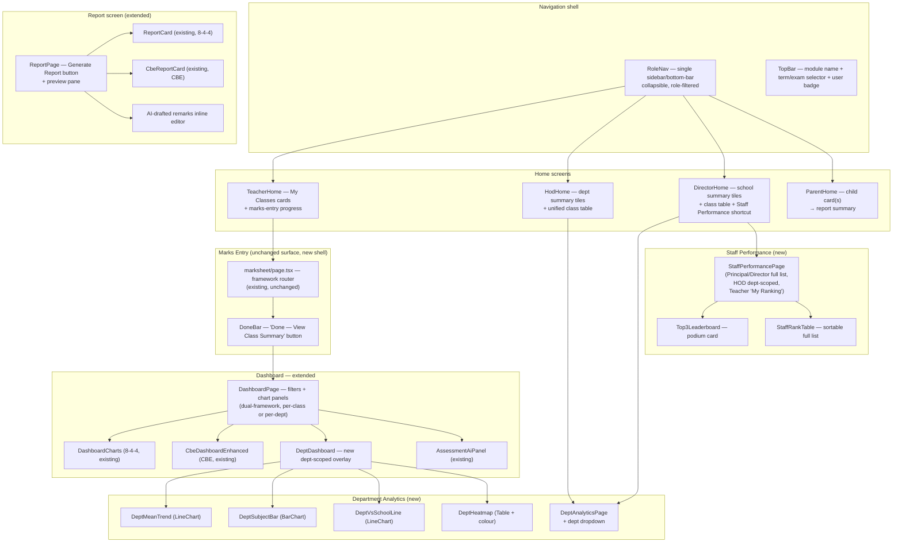
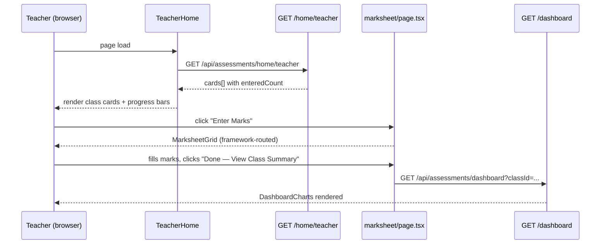
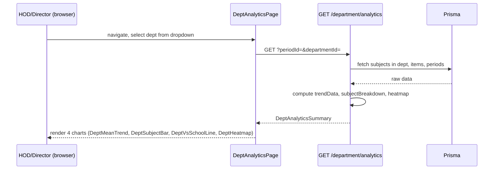
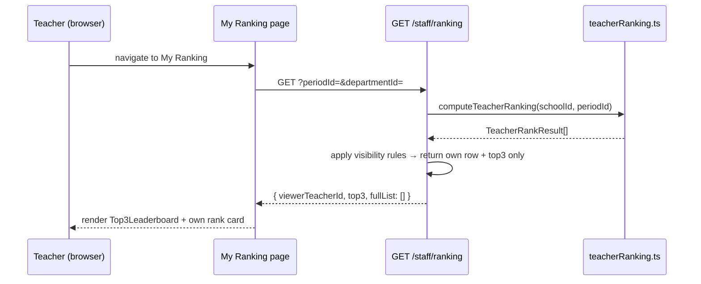

# Design Document: Examination & Analytics Module (Stage 6)

## Overview

This module delivers the coherent product shell that unifies the existing 8-4-4 marksheet (Stage 1) and CBE marksheet (Stage 2) behind a single, role-aware navigation and extends them with: a unified home screen per role, a department-level analytics layer, a staff performance / teacher ranking feature, a report generation surface with AI-drafted remarks, and a comprehensive dual-framework dashboard chart set.

Stages 1 and 2 are complete. Stage 6 is additive — existing components (`MarksheetGrid`, `CbeJuniorGrid`, `CbePathwayGrid`, `DashboardCharts`, `CbeDashboardEnhanced`, `ReportCard`, `AssessmentAiPanel`) are reused unchanged or extended. Two new Prisma models are introduced via a single migration: `RankingConfig` (persisted ranking weights per school) and `ReportRemark` (persisted per-student report remarks). All other new features read from the existing Prisma models.

---

## Architecture



---

## Components and Interfaces

### Component 1: RoleNav

**Purpose**: Single collapsible sidebar that renders only the nav items relevant to the signed-in role. Collapses to a 4-icon bottom bar on mobile.

**Interface**:
```typescript
interface RoleNavProps {
  role: 'SUBJECT_TEACHER' | 'CLASS_TEACHER' | 'HOD' | 'EXAM_OFFICER' | 'DIRECTOR' | 'PARENT';
  items: NavItem[];
}

interface NavItem {
  href: string;
  label: string;
  icon: string;
  group?: string;
}
```

**Nav items by role**:
| Role | Items |
|------|-------|
| Subject Teacher | My Classes → Marks Entry, My Dashboard, My Ranking |
| Class Teacher | + Class Overview |
| HOD / Exam Officer | + Department Analytics, School Analytics, Exam Setup |
| Director / Principal | + School Analytics (full), Department Analytics, Staff Performance, Admin Controls |
| Parent | My Child, Reports |

**Responsibilities**:
- Read role from session; never render greyed-out unavailable items — absent if irrelevant
- On mobile (< 768 px): collapse to bottom nav showing top 4 items as icon buttons
- Active item highlighted; no competing elements in the top bar

---

### Component 2: TopBar

**Purpose**: Persistent header across every role and framework showing module context.

**Interface**:
```typescript
interface TopBarProps {
  moduleTitle: string;        // "Examination & Analytics"
  termLabel: string;          // "Term 2, 2026 — Mid-Term"
  userName: string;
  roleLabel: string;
  onTermChange: (periodId: string) => void;
  periods: { id: string; label: string }[];
}
```

**Responsibilities**:
- Module name on the left, single term/exam selector dropdown in the centre, user name/role badge on the right
- No curriculum toggle anywhere — framework is resolved automatically from `SchoolClass.frameworkType`

---

### Component 3: TeacherHome

**Purpose**: Teacher-facing home screen focused exclusively on "what do I still need to do?"

**Interface**:
```typescript
interface TeacherHomeProps {
  classes: TeacherClassCard[];
}

interface TeacherClassCard {
  classId: string;
  className: string;
  subjectName: string;
  periodId: string;
  totalStudents: number;
  enteredCount: number;   // students with at least one mark
  marksheetHref: string;
}
```

**Responsibilities**:
- Render one card per (class, subject) pair assigned to the teacher
- Progress indicator: "32/40 marks entered" with a thin progress bar
- Single CTA: **Enter Marks** button per card
- No charts — this screen answers only "what do I still need to do?"

---

### Component 4: HodHome

**Purpose**: HOD home — department-scoped summary tiles + class table.

**Interface**:
```typescript
interface HodHomeProps {
  departmentId: string;
  departmentName: string;
  periodId: string;
  summary: DeptSummaryTiles;
  classes: UnifiedClassRow[];
}

interface DeptSummaryTiles {
  deptMean: number | null;
  deptMeanGrade: string | null;
  weakestSubjectName: string | null;
  learnersAtRisk: number;
  entryCompletionPct: number;
}
```

**Responsibilities**:
- Four summary tiles: Department Mean, Weakest Subject, Learners Flagged, Entry Completion %
- Unified class table below with a small framework badge per row (informational only)
- Department Analytics shortcut

---

### Component 5: DirectorHome

**Purpose**: Principal/Director home — school-wide summary tiles + class table + Staff Performance shortcut.

**Interface**:
```typescript
interface DirectorHomeProps {
  periodId: string;
  summary: SchoolSummaryTiles;
  classes: UnifiedClassRow[];
}

interface SchoolSummaryTiles {
  schoolMean: number | null;
  schoolMeanGrade: string | null;
  topSubjectName: string | null;
  learnersAtRisk: number;
  entryCompletionPct: number;
  totalLearners: number;
  totalTeachingStaff: number;
}
```

---

### Component 6: UnifiedClassTable

**Purpose**: Shared class-list table used on HOD and Director home screens.

**Interface**:
```typescript
interface UnifiedClassTableProps {
  rows: UnifiedClassRow[];
}

interface UnifiedClassRow {
  classId: string;
  className: string;
  form: number;
  frameworkType: 'EIGHT_FOUR_FOUR' | 'CBE';
  meanGrade: string | null;    // "B+" for 8-4-4, "ME" for CBE
  studentCount: number;
  entryCompletionPct: number;
  marksheetHref: string;
  dashboardHref: string;
}
```

**Responsibilities**:
- Framework badge per row (colour-coded pill: blue = 8-4-4, green = CBE) — informational only
- Rows link to the class marksheet and dashboard
- No separate view per framework — both 8-4-4 and CBE classes appear in the same table

---

### Component 7: DeptAnalyticsPage + sub-charts (new)

**Purpose**: Department-scoped analytics view, accessible to HOD and Director via a dept dropdown.

**Sub-components**:

```typescript
// DeptMeanTrend — line chart of dept mean across terms
interface DeptMeanTrendProps {
  deptId: string;
  trendData: Array<{ period: string; meanPoints: number | null }>;
}

// DeptSubjectBar — bar chart of every subject in the dept, side by side
interface DeptSubjectBarProps {
  subjects: Array<{ subjectId: string; subjectName: string; meanGrade: string | null; meanPoints: number | null }>;
}

// DeptVsSchoolLine — dept mean vs whole-school mean on the same chart
interface DeptVsSchoolLineProps {
  trendData: Array<{ period: string; deptMean: number | null; schoolMean: number | null }>;
}

// DeptHeatmap — class × subject heatmap, scoped to dept subjects only
interface DeptHeatmapProps {
  rows: Array<{ className: string; subjects: Array<{ subjectId: string; meanScore: number | null }> }>;
  subjectColumns: Array<{ id: string; name: string }>;
}
```

**Responsibilities**:
- Department selector at top — simple dropdown, no separate nav per department
- HOD sees only their own department; Director sees all departments selectable
- Identical red-to-green colour scale as all other charts

---

### Component 8: StaffPerformancePage (new)

**Purpose**: Teacher ranking surface with visibility rules enforced at the component level (backed by server-side scoping).

**Interface**:
```typescript
interface StaffPerformancePageProps {
  viewerRole: 'DIRECTOR' | 'HOD' | 'SUBJECT_TEACHER';
  viewerTeacherId: string;
  ranking: TeacherRankRow[];
  departmentId?: string;   // HOD scope
}

interface TeacherRankRow {
  teacherId: string;
  teacherName: string;
  subjectName: string;
  departmentName: string;
  compositeScore: number;
  rank: number;
  trendDirection: 'UP' | 'DOWN' | 'STABLE';
}
```

**Visibility rules**:
| Viewer | Sees |
|--------|------|
| Subject Teacher | Own rank/score + trend + Top 3 podium only |
| HOD | Dept-scoped ranked list only |
| Director / Principal | Full ranked list, sortable |

**Sub-components**:
- `Top3Leaderboard` — podium-style card (1st/2nd/3rd, crown icon on 1st). Teachers see this always.
- `StaffRankTable` — full sortable list for Director/HOD only.

---

### Component 9: ReportPage (extended)

**Purpose**: Report card generation surface with AI-drafted remarks.

**Interface**:
```typescript
interface ReportPageProps {
  studentId?: string;   // single student
  classId?: string;     // class-wide
  periodId: string;
  canEdit: boolean;     // class teacher / exam officer can edit remarks
}
```

**Responsibilities**:
- Single **Generate Report** button — no config screen unless "Report Settings" explicitly opened
- Preview renders in a print-styled pane, visually distinct from the dashboard
- AI-drafted remark in a lightly shaded box labelled "AI-drafted comment — review before sending" with inline edit field
- Two action buttons only: **Download PDF** and **Email to Parent**
- Framework-aware: renders `ReportCard` (8-4-4) or `CbeReportCard` (CBE) based on `SchoolClass.frameworkType`

---

### Component 10: TeacherRankingService (new — server utility)

**Purpose**: Computes the composite teacher ranking score used by `StaffPerformancePage`.

**Location**: `src/lib/assessment/teacherRanking.ts`

**Interface**:
```typescript
export interface TeacherRankInput {
  teacherId: string;
  subjectId: string;
  classId: string;
  currentPeriodId: string;
  previousPeriodId: string | null;
}

export interface TeacherRankResult {
  teacherId: string;
  compositeScore: number;   // 0–100
  improvementScore: number; // +/- change in class mean grade points
  completionScore: number;  // 0–1 fraction of marks entered
  trendDirection: 'UP' | 'DOWN' | 'STABLE';
  rank: number;
}

export async function computeTeacherRanking(
  schoolId: string,
  periodId: string,
  departmentId?: string,
  /** If omitted, weights are loaded from RankingConfig DB row (or defaults). */
  weights?: { improvementWeight: number; completionWeight: number; absoluteWeight: number }
): Promise<TeacherRankResult[]>
```

**Ranking formula** (weights loaded from `RankingConfig` DB row for the school; fallback defaults 0.4/0.3/0.3 if no row exists):
```
compositeScore =
  (improvementWeight × normalise(improvementScore))
  + (completionWeight × completionScore)
  + (absoluteWeight   × normalise(classMeanPoints))
```

---

### Component 11: SettingsHub (restructured `/principal/settings`)

**Purpose**: Unified settings shell for the principal/director — consolidates API integrations, ranking weights configuration, and exam setup shortcuts in one place. Replaces the current flat `IntegrationSettingsPage`.

**Location**: `src/app/principal/settings/page.tsx` (restructured) with sub-sections at:
- `src/app/principal/settings/api-integrations/` — extracted from existing `IntegrationSettingsPage`
- `src/app/principal/settings/ranking-config/` — new

**Interface**:
```typescript
// RankingConfigForm props (sub-component within settings)
interface RankingConfigFormProps {
  initialWeights: {
    improvementWeight: number;
    completionWeight: number;
    absoluteWeight: number;
  };
  canEdit: boolean;   // true for Director/HOD, false for others (read-only view)
}
```

**Responsibilities**:
- Settings hub `page.tsx` renders a tab bar or anchored section list: API Integrations | Ranking Configuration | Exam Setup
- **API Integrations tab**: renders the existing `SchoolIntegration` provider cards — zero behaviour change, just moved into the hub shell
- **Ranking Configuration tab**: three numeric inputs (0–1, two decimal places) for the weights; client-side sum validation before submit; calls `PUT /api/settings/ranking-config`; shows last-updated timestamp from `RankingConfig.updatedAt`
- **Exam Setup tab**: shortcut card linking to `/principal/assessments/exam-setup` (existing page) — no duplication, just a navigation shortcut with a brief description
- HOD users reach Ranking Configuration via a "Configure ranking weights →" link on the Staff Performance page (they do not get the full Settings hub in nav)

---

## Data Models

### Existing models used (no schema changes)

| Model | Usage |
|-------|-------|
| `AssessmentPeriod` | Term/exam selector source; trend data |
| `AssessmentItem` | All mark data — 8-4-4 numeric, CBE performance level |
| `AssessmentFramework` | Framework type resolution |
| `SchoolClass` | `frameworkType` field drives component routing |
| `Teacher` + `AssessmentRole` | Ranking source; access scoping |
| `Subject` + `Department` | Dept analytics scoping |
| `Paper` | 8-4-4 grade calculation |
| `SubStrand` / `LearningArea` | CBE attainment aggregation |
| `SchoolIntegration` | AI/SMS/email API key storage (already exists, reused in Settings Hub) |

### New Prisma models (one migration)

**Migration file**: `prisma/migrations/20260720000000_add_ranking_config_and_report_remark/migration.sql`

#### `RankingConfig`

```prisma
/// Per-school ranking weight configuration for the teacher composite score.
/// One row per school. Created on first PUT /api/settings/ranking-config call.
/// If no row exists, the service defaults to 0.4 / 0.3 / 0.3 in code.
model RankingConfig {
  schoolId          String   @id
  /// Weight for the improvement-over-previous-period component (0.0–1.0).
  improvementWeight Float    @default(0.4)
  /// Weight for the marks-entry completion component (0.0–1.0).
  completionWeight  Float    @default(0.3)
  /// Weight for the absolute class mean points component (0.0–1.0).
  absoluteWeight    Float    @default(0.3)
  updatedAt         DateTime @updatedAt
  school            School   @relation(fields: [schoolId], references: [id], onDelete: Cascade)
}
```

**DB constraint**: A CHECK constraint in the migration enforces `improvementWeight + completionWeight + absoluteWeight = 1.0` (within float tolerance via `ABS(sum - 1) < 0.001`).

#### `ReportRemark`

```prisma
/// One row per (school, period, student) — stores the AI-drafted remark and
/// any teacher-edited override. Created on first GET (AI draft generated)
/// or first PUT (manual save). Cascade-deletes with the school.
model ReportRemark {
  id            String   @id @default(cuid())
  schoolId      String
  periodId      String
  studentId     String
  /// AI-generated draft text. May be null if AI service was unavailable.
  draftRemark   String?
  /// Teacher-edited text. If non-null, this is used in the PDF/preview
  /// instead of draftRemark.
  editedRemark  String?
  isAiGenerated Boolean  @default(true)
  createdAt     DateTime @default(now())
  updatedAt     DateTime @updatedAt
  school        School   @relation(fields: [schoolId], references: [id], onDelete: Cascade)
  period        AssessmentPeriod @relation(fields: [periodId], references: [id], onDelete: Cascade)
  student       Student  @relation(fields: [studentId], references: [id], onDelete: Cascade)

  @@unique([schoolId, periodId, studentId])
  @@index([schoolId, periodId])
}
```

### Schema additions required on existing models

Add back-relations to `School`, `AssessmentPeriod`, and `Student` for the new models. These are non-breaking additive changes handled by the same migration.

```prisma
// On School:
rankingConfig  RankingConfig?
reportRemarks  ReportRemark[]

// On AssessmentPeriod:
reportRemarks  ReportRemark[]

// On Student:
reportRemarks  ReportRemark[]
```

---

## API Routes (new)

All new routes follow the same auth pattern as existing assessment routes: `getCurrentUser()` → `resolveAssessmentActor()` → role guard.

### `GET /api/assessments/home/teacher`

Returns `TeacherClassCard[]` — one entry per (class, subject) the teacher is assigned to, with `enteredCount`.

**Guard**: authenticated teacher.

**Response**:
```typescript
{
  cards: Array<{
    classId: string; className: string;
    subjectId: string; subjectName: string;
    periodId: string; periodName: string;
    totalStudents: number; enteredCount: number;
  }>
}
```

---

### `GET /api/assessments/home/summary`

Returns summary tiles for HOD or Director home.

**Query params**: `scope = 'school' | 'department'`, `departmentId?`

**Guard**: `canAccessDashboard(actor)`.

**Response**:
```typescript
{
  scope: 'school' | 'department';
  meanPoints: number | null;
  meanGrade: string | null;
  weakestSubjectName: string | null;
  learnersAtRisk: number;
  entryCompletionPct: number;
  // school scope only:
  totalLearners?: number;
  totalTeachingStaff?: number;
  topSubjectName?: string;
}
```

---

### `GET /api/assessments/department/analytics`

Returns all data for the department analytics charts.

**Query params**: `periodId` (required), `departmentId` (required).

**Guard**: HOD (own dept only) or Director/Principal (any dept).

**Response**:
```typescript
{
  department: { id: string; name: string };
  period: { id: string; name: string; academicYear: string };
  deptMeanPoints: number | null;
  deptMeanGrade: string | null;
  subjectBreakdown: Array<{
    subject: { id: string; name: string };
    meanPoints: number | null;
    meanGrade: string | null;
    studentCount: number;
  }>;
  trendData: Array<{ period: { id: string; name: string }; deptMean: number | null; schoolMean: number | null }>;
  heatmap: Array<{
    className: string;
    subjects: Array<{ subjectId: string; meanScore: number | null }>;
  }>;
  subjectColumns: Array<{ id: string; name: string }>;
}
```

---

### `GET /api/assessments/staff/ranking`

Returns the teacher ranking for the selected period.

**Query params**: `periodId` (required), `departmentId?` (HOD scoping).

**Guard**:
- Teacher: only own row + top 3 returned
- HOD: dept-scoped list
- Director/Principal: full list

**Response**:
```typescript
{
  viewerTeacherId: string;
  top3: TeacherRankRow[];         // always returned for all roles
  fullList: TeacherRankRow[];     // only populated for HOD/Director
  periodName: string;
}
```

---

### `GET /api/assessments/report/remarks`

Fetches or generates the AI-drafted remark for a student's period.

**Query params**: `periodId`, `studentId`.

**Guard**: `canGenerateReportCard(actor, student.classId)`.

**Response**:
```typescript
{
  studentId: string;
  periodId: string;
  draftRemark: string;       // AI-drafted text
  isAiGenerated: boolean;
  editedRemark: string | null;  // if teacher has saved an edit
}
```

---

### `PUT /api/assessments/report/remarks`

Saves the teacher's edited remark.

**Body**: `{ periodId: string; studentId: string; remark: string }`

**Guard**: `canGenerateReportCard(actor, student.classId)`.

---

### `GET /api/settings/ranking-config`

Fetches the current ranking weights for the school.

**Guard**: `canAccessDashboard(actor)` (HOD, Director, Principal).

**Response**:
```typescript
{
  improvementWeight: number;  // default 0.4 if no RankingConfig row yet
  completionWeight:  number;  // default 0.3
  absoluteWeight:    number;  // default 0.3
  updatedAt:         string | null;  // ISO timestamp, null if using defaults
}
```

---

### `PUT /api/settings/ranking-config`

Upserts the ranking weights for the school.

**Guard**: HOD or Director only — HTTP 403 for SUBJECT_TEACHER, CLASS_TEACHER, PARENT_VIEWER.

**Body**:
```typescript
{
  improvementWeight: number;
  completionWeight:  number;
  absoluteWeight:    number;
}
```

**Validation**: Server-side check that `improvementWeight + completionWeight + absoluteWeight` is within 0.001 of 1.0. Returns HTTP 422 with `{ error: "Weights must sum to 1.0" }` if invalid.

**Response**: Updated `RankingConfig` row (same shape as GET response).

---

## Sequence Diagrams

### Teacher Home → Marks Entry → Class Summary



### Department Analytics



### Teacher Ranking



---

## Error Handling

### Empty / partial data states

| Scenario | UI response |
|----------|-------------|
| Class with no marks in a period | "No marks entered yet for Term 2 Mid-Term — tap Enter Marks to get started" |
| Dashboard with incomplete data | "Showing partial results — N subjects still pending" — never silently renders misleading chart |
| Department with no assessed subjects | Empty state with "No assessment data for this department yet" |
| Teacher with no ranking data | "Rankings are published after the current period closes" |
| AI remarks endpoint fails | Inline error with manual-entry fallback; report generation proceeds without AI remarks |

### Access violations

- Any `403` from assessment APIs → redirect to role home with "Access denied" toast
- HOD attempting to access out-of-scope dept analytics → server returns 403, client shows "You can only view analytics for your own department"

---

## Testing Strategy

### Unit Testing Approach

- `teacherRanking.ts`: pure function, test composite score formula with known inputs
- Department analytics computation: test that scoping to `departmentId` correctly excludes out-of-dept subjects
- Visibility rule enforcement: test that teacher role returns only own row + top 3, not full list

### Property-Based Testing Approach

**Property Test Library**: fast-check (already used in project)

Properties are enumerated in the Correctness Properties section below.

### Integration Testing Approach

- Full department analytics endpoint: seed a school with 3 departments, 2 frameworks, assert correct scoping
- Staff ranking endpoint: assert HOD sees only own department, teacher sees only top 3 + own row

---

## Performance Considerations

- Department analytics: a single SQL query groups by `(subjectId, classId)` using `GROUP BY` in a raw Prisma query to avoid N+1 subject loops; applies to both frameworks
- Teacher ranking: computed lazily on request; cached per (schoolId, periodId) in memory for 60 s using a module-level `Map`
- Dashboard charts already use Recharts `ResponsiveContainer` — no changes needed

---

## Security Considerations

- Dept analytics scoping: `departmentId` param is always validated server-side against `teacher.primaryDepartmentId` for HOD role — client cannot request cross-dept data
- Teacher ranking: the response shape for SUBJECT_TEACHER never includes `fullList`; populated with `[]` on the server, not filtered on the client
- Report remarks: AI draft is generated server-side; raw Gemini API key is never exposed to the browser (uses existing `SchoolIntegration` encryption layer)

---

## Mobile Behaviour

- Sidebar → 4-icon bottom bar (existing `Sidebar` component already handles this via responsive CSS)
- Marks entry grid: existing `MarksheetGrid` swipeable card layout for small screens (already designed in Stages 1–2)
- Dashboard charts: full-width, one at a time via swipe/scroll (existing `ResponsiveContainer` layout)
- Top 3 leaderboard: compact horizontal-scroll card on teacher home

---

## Dependencies

- Recharts — already installed; used for all chart sub-components
- fast-check — property tests
- AssessmentAiPanel — existing component reused in department analytics and report remarks
- `grading844.ts` — existing grading utility reused for teacher ranking absolute score
- `gradingCbe.ts` — existing CBE grading utility reused for CBE dept analytics

---

## Correctness Properties

*A property is a characteristic or behavior that should hold true across all valid executions of a system — essentially, a formal statement about what the system should do. Properties serve as the bridge between human-readable specifications and machine-verifiable correctness guarantees.*

### Property 1: Teacher home entry count is consistent with the marksheet

*For any* teacher, class, subject, and period, the `enteredCount` shown on the Teacher Home card SHALL equal the count of distinct students in that class who have at least one `AssessmentItem` row for that subject and period in the database.

**Validates: Requirements 2.1, 2.3**

### Property 2: Teacher home cards match assignments exactly

*For any* teacher with N (class, subject) assignments in the current period, the Teacher Home SHALL display exactly N cards — no more and no fewer.

**Validates: Requirements 2.1**

### Property 3: UnifiedClassTable row completeness

*For any* class row in the UnifiedClassTable, the rendered row SHALL contain all required fields: class name, form, Framework_Badge, mean grade (or "—"), student count, Entry_Completion_Pct, and links to the marksheet and dashboard.

**Validates: Requirements 4.4**

### Property 4: Framework badge distinguishes frameworks

*For any* pair of classes where one has `frameworkType = EIGHT_FOUR_FOUR` and the other has `frameworkType = CBE`, their Framework_Badges SHALL have distinct visual styling (different colour or label). The badge for a given class SHALL match its `frameworkType` exactly.

**Validates: Requirements 4.5**

### Property 5: Dept analytics subject scoping

*For any* department analytics API response, every subject appearing in `subjectBreakdown` SHALL have `subject.departmentId` equal to the requested `departmentId`. No subject from another department SHALL appear in the response.

**Validates: Requirements 6.2, 6.9**

### Property 6: Dept heatmap class scoping

*For any* department analytics response, every class row in the heatmap SHALL have at least one student who has been assessed in at least one subject belonging to the requested department. No class whose students have no assessments in the requested department SHALL appear.

**Validates: Requirements 6.4**

### Property 7: Dept vs. school mean consistency

*For any* period, the `schoolMean` value in the `DeptVsSchoolLine` chart data SHALL equal the `overallMeanPoints` returned by `GET /api/assessments/dashboard` for the same period and school scope, within floating-point tolerance.

**Validates: Requirements 6.4**

### Property 8: HOD dept access control

*For any* HOD user and any `departmentId` that is not the HOD's own department, `GET /api/assessments/department/analytics` SHALL return HTTP 403 and SHALL NOT return any assessment data.

**Validates: Requirements 6.2, 12.3**

### Property 9: Teacher ranking visibility invariant

*For any* Subject_Teacher user, `GET /api/assessments/staff/ranking` SHALL return `fullList` as an empty array. The response SHALL contain that teacher's own rank data and a `top3` array, but SHALL NOT include any other teacher's rank position, score, or name in `fullList`.

**Validates: Requirements 7.3, 12.4**

### Property 10: HOD ranking dept scoping

*For any* HOD user, every `TeacherRankRow` in `fullList` returned by `GET /api/assessments/staff/ranking` SHALL belong to a teacher whose `primaryDepartmentId` equals the HOD's department. No teacher from another department SHALL appear in an HOD's `fullList`.

**Validates: Requirements 7.4**

### Property 11: Composite score formula correctness

*For any* triple of (improvementScore, completionScore, absoluteScore) and configured weights (improvementWeight, completionWeight, absoluteWeight) where the weights sum to 1.0, `computeTeacherRanking` SHALL produce a `compositeScore` equal to `(improvementWeight × normImprovement) + (completionWeight × completionScore) + (absoluteWeight × normAbsolute)` within floating-point tolerance of 0.001.

**Validates: Requirements 7.1**

### Property 12: Ranking trend direction is monotone consistent

*For any* teacher, if their `compositeScore` in the current period is strictly greater than in the previous period, `trendDirection` SHALL be `UP`. If strictly less, it SHALL be `DOWN`. If equal (within tolerance), it SHALL be `STABLE`.

**Validates: Requirements 7.7**

### Property 13: Report framework routing invariant

*For any* student, the ReportPage SHALL render exactly one of `ReportCard` (8-4-4) or `CbeReportCard` (CBE), determined solely by `student.schoolClass.frameworkType`. A student whose class has `frameworkType = EIGHT_FOUR_FOUR` SHALL never see `CbeReportCard`, and vice versa.

**Validates: Requirements 8.3**

### Property 14: Report remark persistence round-trip

*For any* `(periodId, studentId)` pair, saving a remark via `PUT /api/assessments/report/remarks` and subsequently fetching via `GET /api/assessments/report/remarks` SHALL return the exact saved remark string in `editedRemark`. No truncation, encoding change, or default substitution SHALL occur.

**Validates: Requirements 8.5**

### Property 15: Uniform colour scale across all charts

*For any* grade band or CBE performance level, the colour class (background and text) applied by any chart component in the module SHALL be identical to the colour returned by `gradeColour()` (8-4-4) or `levelColour()` (CBE) utility functions for that band. No chart component SHALL apply an ad-hoc colour that differs from these utilities.

**Validates: Requirements 6.5, 9.3**

### Property 16: Empty data produces empty-state message, not empty chart

*For any* chart component receiving an empty data array (length = 0), the component SHALL render an empty-state message element and SHALL NOT render the chart SVG or canvas element.

**Validates: Requirements 9.5, 11.1**

### Property 17: New endpoints enforce school scoping

*For any* API request to `GET /home/teacher`, `GET /home/summary`, `GET /department/analytics`, `GET /staff/ranking`, `GET /report/remarks`, or `PUT /report/remarks`, every Prisma query executed by the handler SHALL include a `schoolId` filter equal to the authenticated user's `schoolId`. No query SHALL return rows from another school.

**Validates: Requirements 12.1, 12.2, 12.3, 12.4, 12.5, 12.6**
