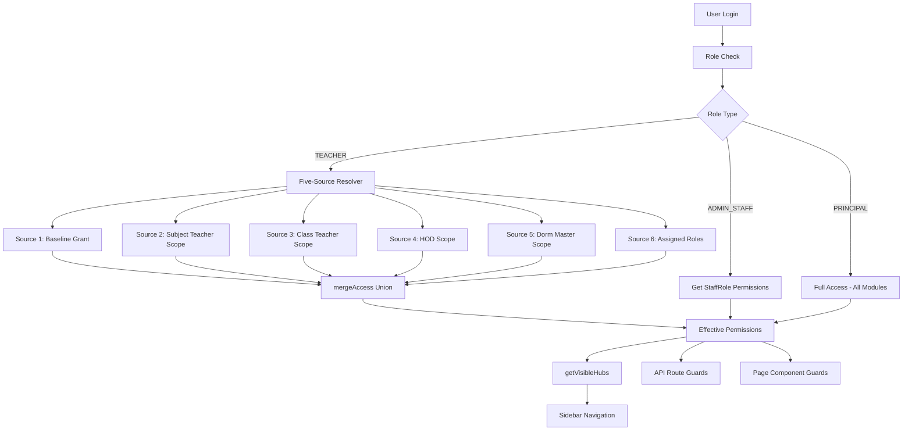

# Design Document: RBAC Visibility Rules

## Overview

This design implements comprehensive role-based access control (RBAC) and visibility rules for the school management system. The core principle is absolute visibility control: if a role cannot view or manage something, that element must not render at all—no greyed-out buttons, no disabled tabs, no visible-but-blocked navigation items, and no API responses that leak unauthorized data.

The system introduces a five-source effective permissions resolver for teachers that automatically computes access based on operational assignments, eliminating manual configuration while ensuring teachers see exactly the modules and actions they need.

### Key Design Principles

1. **DOM Absence over Visual Hiding**: Unauthorized elements are completely absent from the DOM, not just hidden or disabled
2. **API-Layer Enforcement**: All security boundaries are enforced at the API layer, not just the UI
3. **Automatic Permission Derivation**: Teacher permissions are computed automatically from actual operational assignments
4. **Union-Based Permission Merging**: Multiple permission sources are combined using OR-merge logic—no source can reduce what another grants
5. **Single Source of Truth**: The Permission Resolver is the sole authority for all three roles (PRINCIPAL, ADMIN_STAFF, TEACHER)
## Architecture

### Permission Resolution Flow



### Five-Source Permission Architecture

The teacher permission resolver implements a stackable architecture where each source operates independently:

1. **Baseline Grant** (Source 1): Unconditional permissions every teacher receives
2. **Subject Teacher Scope** (Source 2): Derived from `ClassSubjectTeacher` and elective teacher assignments
3. **Class Teacher Scope** (Source 3): Derived from `SchoolClass.classTeacherId`
4. **HOD Scope** (Source 4): Derived from `Department.headTeacherId`
5. **Dorm Master Scope** (Source 5): Derived from `Dormitory.boardingMasterId`
6. **Assigned Roles** (Source 6): Traditional StaffRole assignments via `UserStaffRole`

Each source is evaluated independently and the results are merged using the existing `mergeAccess()` function, ensuring a union (OR) of all capabilities.
## Components and Interfaces

### Core Components

#### 1. Enhanced Permission Resolver (`src/lib/permissions.ts`)

**New Function: `getTeacherEffectivePermissions(user: User): Promise<EffectivePermissions>`**

This function implements the five-source resolution logic:

```typescript
interface PermissionSource {
  name: string;
  condition: (teacher: TeacherQueryResult) => boolean;
  permissions: Partial<Record<Module, Partial<ModuleAccess>>>;
}

const PERMISSION_SOURCES: PermissionSource[] = [
  {
    name: "Baseline Grant",
    condition: () => true, // Always applies
    permissions: {
      RECORDS_DISCIPLINE: { canView: true, canCreate: true },
      RECORDS_ACHIEVEMENTS: { canView: true, canCreate: true },
      ATTENDANCE: { canView: true }
    }
  },
  // ... other sources
];
```

**Modified Function: `requirePermission(module, action)`**
- Remove the early return `null` for TEACHER users
- Add TEACHER case that calls `getTeacherEffectivePermissions()` 
- Eliminate all `?? requireRole("TEACHER")` fallback patterns in API routes

#### 2. Teacher Permission Cache (`src/lib/teacherPermissionCache.ts`)

A lightweight caching layer to avoid repeated database queries for the same teacher within a request cycle:

```typescript
interface CacheEntry {
  permissions: EffectivePermissions;
  timestamp: number;
  ttl: number; // 5 minutes
}

export class TeacherPermissionCache {
  private cache = new Map<string, CacheEntry>();
  
  async getOrCompute(userId: string): Promise<EffectivePermissions>;
  invalidate(userId: string): void;
  cleanup(): void; // Remove expired entries
}
```
#### 3. People Hub Page (`src/app/teacher/people/page.tsx`)

**New Page Component**: Displays tiles for each teaching assignment

```typescript
interface AssignmentTile {
  id: string;
  type: 'class_teacher' | 'subject_teacher' | 'elective_teacher';
  title: string; // e.g., "English — 4X" or "Class Teacher — 3 North"
  subjectId?: string;
  classId: string;
  className: string;
  subjectName?: string;
  studentCount: number;
  canAddStudents: boolean; // Only true for elective tiles
}
```

**Add Students Modal** (`src/components/teacher/AddStudentsModal.tsx`):
- Lists students in the class not enrolled in the elective subject
- Multi-select with checkboxes
- Creates `StudentElective` records via POST to `/api/students/electives`

#### 4. Enhanced Students Page (`src/app/teacher/students/page.tsx`)

**Modified Behavior**:
- Default filter to teacher's own class (if class teacher)
- Show edit buttons only for students in teacher's class
- Search functionality remains unrestricted (all classes)

```typescript
interface StudentPageProps {
  defaultClassFilter?: string; // Set to classTeacherOf.id if applicable
  canEditStudent: (student: Student) => boolean;
}
```

#### 5. Enhanced Attendance Page (`src/app/teacher/attendance/page.tsx`)

**New "View" Tab**:
- Read-only attendance data for all classes the teacher teaches
- Includes class tiles from `ClassSubjectTeacher`, `ClassElectiveGroupTeacher`, and class teacher assignment
- Date range selection with trend analysis
- Consumes existing `Attendance` model records
#### 6. Enhanced Exams & Analysis Page (`src/app/teacher/assessments/page.tsx`)

**New Tab Structure**:
- **"My Subjects" Tab**: Available when teacher has `ClassSubjectTeacher` or elective teacher rows
- **"My Department" Tab**: Available when teacher is HOD (`Department.headTeacherId`)
- **"Overview" Tab**: Existing full-school view (Principal/Admin Staff only)

```typescript
interface ExamsAnalysisTab {
  id: 'my_subjects' | 'my_department' | 'overview';
  label: string;
  visible: boolean;
  isDefault: boolean;
  scope: 'teacher_subjects' | 'department' | 'school_wide';
}
```

#### 7. Enhanced Staff Directory API (`src/app/api/staff/route.ts`)

**Conditional Response Trimming**:
```typescript
function trimStaffResponse(user: User, fullRecord: StaffRecord): TrimmedStaffRecord {
  const permissions = await getTeacherEffectivePermissions(user);
  
  if (!permissions.STAFF?.canView) {
    // Return trimmed view for plain subject teachers
    return {
      id: fullRecord.id,
      fullName: fullRecord.fullName,
      designation: fullRecord.designation,
      primaryDepartment: { name: fullRecord.primaryDepartment?.name },
      staffId: fullRecord.staffId
      // email, phone, and other fields are omitted
    };
  }
  
  return fullRecord; // Full access for others
}
```

### Interface Definitions

#### Enhanced EffectivePermissions Interface

The existing `EffectivePermissions` type remains unchanged, but usage patterns are enhanced:

```typescript
// Existing type (unchanged)
export type EffectivePermissions = Partial<Record<Module, ModuleAccess>>;

// New utility functions
export function hasModuleAccess(perms: EffectivePermissions, module: Module, action: PermissionAction): boolean;
export function getAccessibleModules(perms: EffectivePermissions): Module[];
export function canAccessHub(perms: EffectivePermissions, hub: NavHub): boolean;
```
## Data Models

### Database Access Patterns

#### 1. Teacher Permission Query Optimization

The `getTeacherEffectivePermissions()` function requires efficient queries to avoid N+1 problems:

```sql
-- Single query to fetch all teacher assignment data
SELECT 
  t.id,
  t.userId,
  -- Class teacher assignment
  ct.id as classTeacherOfId,
  ct.name as classTeacherOfName,
  -- Department head assignment  
  dt.id as departmentHeadOfId,
  dt.name as departmentHeadOfName,
  -- Subject teacher assignments
  json_agg(DISTINCT jsonb_build_object(
    'classId', cst.classId,
    'subjectId', cst.subjectId,
    'subjectName', s.name,
    'className', sc.name
  )) FILTER (WHERE cst.classId IS NOT NULL) as subjectAssignments,
  -- Elective teacher assignments
  json_agg(DISTINCT jsonb_build_object(
    'groupId', egt.groupId,
    'subjectId', egt.subjectId,
    'subjectName', s2.name
  )) FILTER (WHERE egt.groupId IS NOT NULL) as electiveAssignments,
  -- Class-specific elective assignments
  json_agg(DISTINCT jsonb_build_object(
    'groupId', cegt.groupId,
    'classId', cegt.classId,
    'subjectId', cegt.subjectId,
    'subjectName', s3.name,
    'className', sc2.name
  )) FILTER (WHERE cegt.groupId IS NOT NULL) as classElectiveAssignments,
  -- Dormitory assignments
  json_agg(DISTINCT jsonb_build_object(
    'dormId', d.id,
    'dormName', d.name,
    'capacity', d.totalCapacity,
    'genderPolicy', d.genderPolicy
  )) FILTER (WHERE d.id IS NOT NULL) as dormitoryAssignments
FROM Teacher t
LEFT JOIN SchoolClass ct ON ct.classTeacherId = t.id
LEFT JOIN Department dt ON dt.headTeacherId = t.id
LEFT JOIN ClassSubjectTeacher cst ON cst.teacherId = t.id
LEFT JOIN Subject s ON s.id = cst.subjectId
LEFT JOIN SchoolClass sc ON sc.id = cst.classId
LEFT JOIN ElectiveGroupTeacher egt ON egt.teacherId = t.id
LEFT JOIN Subject s2 ON s2.id = egt.subjectId
LEFT JOIN ClassElectiveGroupTeacher cegt ON cegt.teacherId = t.id
LEFT JOIN Subject s3 ON s3.id = cegt.subjectId
LEFT JOIN SchoolClass sc2 ON sc2.id = cegt.classId
LEFT JOIN Dormitory d ON d.boardingMasterId = t.id
WHERE t.userId = $1 AND t.schoolId = $2
GROUP BY t.id, ct.id, ct.name, dt.id, dt.name;
```

#### 2. Scoped API Query Patterns

**Class-Scoped Student Queries** (for class teachers):
```sql
-- Students page with class teacher scope
SELECT s.id, s.fullName, s.admissionNumber, s.classId
FROM Student s
INNER JOIN Teacher t ON t.userId = $teacherUserId
WHERE s.schoolId = $schoolId
  AND ($isClassTeacher = false OR s.classId = t.classTeacherOfId)
ORDER BY s.fullName;
```

**Department-Scoped Analytics** (for HODs):
```sql
-- Analytics scoped to HOD's department subjects
SELECT s.id, s.name, COUNT(ai.id) as assessment_count
FROM Subject s
INNER JOIN Department d ON d.id = s.departmentId
INNER JOIN Teacher t ON t.userId = $teacherUserId AND t.departmentHeadOfId = d.id
LEFT JOIN AssessmentItem ai ON ai.subjectId = s.id
WHERE s.schoolId = $schoolId
GROUP BY s.id, s.name;
```

## Timetable Admin Access Control (R10)

### Route Architecture

The existing `/principal/timetable/*` tree is untouched. A parallel `/staff/timetable/*` tree is added for ADMIN_STAFF with management rights, sharing the same page components via a **`basePath` prop pattern**:

1. **`TIMETABLE_NAV` becomes dynamic** — a new `getTimetableNav(basePath: string)` helper replaces the hardcoded `/principal/timetable` array in `src/lib/timetable/navItems.ts`.
2. **Shared page components** — each timetable page (Overview, Generate, Builder, Settings, etc.) receives a `basePath: string` prop and replaces every hardcoded `/principal/timetable/...` href with `${basePath}/...`.
3. **Staff route wrappers** — thin Next.js page files under `src/app/staff/timetable/` that call the same shared component with `basePath="/staff/timetable"`.
4. **Staff timetable layout guard** — `src/app/staff/timetable/layout.tsx` calls `getEffectivePermissions(user)` and redirects to the read-only personal schedule if neither `TIMETABLE.canManage` nor `TIMETABLE.canConfigure` is true.

### Timetable Link Routing for ADMIN_STAFF

In the Academic hub navigation (within `src/app/staff/academics/page.tsx` or equivalent context nav):
- Compute `hasTimetableAdmin = perms.TIMETABLE?.canManage || perms.TIMETABLE?.canConfigure`
- Link href = `hasTimetableAdmin ? "/staff/timetable" : "/teacher/timetable"` (personal read-only)

### Read-Only Personal Timetable

ADMIN_STAFF without timetable-manage rights is served the same personal-schedule component as teachers, accessed via the existing `/teacher/timetable`-equivalent API route (role-agnostic read for the logged-in user's lessons). No new API route needed.
